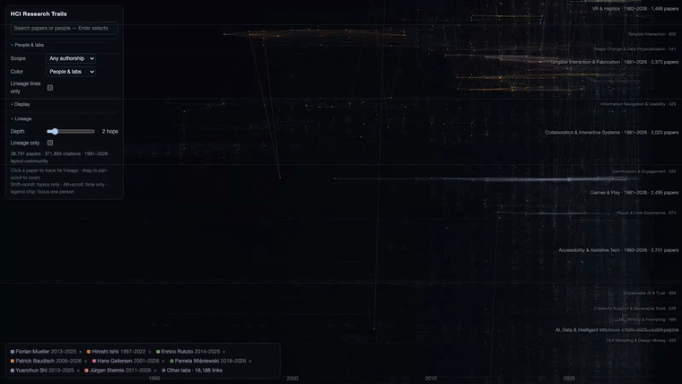

# HCI Research Trails

**Live: https://hci-research-trails.vercel.app**

An interactive map of 45 years of HCI research — **38,791 papers and 371,893 citations
from 13 major venues (1981–2026)**, laid out along time on a single WebGL canvas.
Research areas appear as named horizontal bands; citations flow left to right.


## 1. Trace a paper's lineage


- Click any paper: everything it builds on (upstream) and everything that later built on
  it (downstream) lights up, without losing your place on the map.
- The side panel breaks the lineage down by research trend, with upstream:downstream
  ratio bars — click a trend to filter the view to it.
- **Local clusters** split the lineage by its own citation structure — e.g. UltraHaptics'
  708 descendants resolve into seven branches (VR haptics, mid-air ultrasound, EMS,
  levitation, …). Optional LLM naming for the branches, using your own API key.
- Authors, corpus coverage, and DOI links included. Right-click a paper for DOI and
  copy actions without touching the selection.
- How all of this is computed: [docs/lineage.md](docs/lineage.md).

## 2. Follow a person


- Search a name and pin it to a colour (up to 15 people).
- Their papers surface across the map, and same-lab citations (same last author at both
  ends) draw the lab's thread through the decades.
- Click a legend chip to focus one person: only their papers stay bright and clickable.
- A toggle switches between "any authorship" and "last-author only".

## 3. Explore the field


- 14 bands and 117 sub-fields, all named; labels appear as you zoom.
- Browse them all from the **Fields tree** (or search them by name): selecting a field
  highlights its papers and lists the most cited ones.
- **Shift+scroll zooms topics without stretching time**; Alt+scroll zooms time only.
- Search any topic ("haptic", "fabrication") to see where and when it lives on the map,
  with related-term suggestions.
- Colour by people & labs, or by venue.

## Tutorial



A longer walkthrough: [docs/media/tutorial.mp4](docs/media/tutorial.mp4)

## Reading the map

- **x-axis = publication year.** Citations only ever flow left to right.
- **Bands = citation communities**, sized by paper count.
- **Bright routes = main paths** (edges weighted by search path count).
- **Dot size = citations.** Colours belong to the people you pin.

## Data notes

Corpus: CHI, PACM HCI, UIST, DIS, ASSETS, IUI, CSCW, TEI, IMWUT, UbiComp, CHI PLAY,
MobileHCI, TOCHI. A **Related venues** toggle adds HRI, IEEE VR, ISMAR, SIGGRAPH,
TOG, IJHCS and IEEE ToH — partially: only papers with at least one citation link to
the core corpus are included, and the UI marks them as such. About 75% of references point outside these venues and are excluded —
the UI states this wherever it limits what you see (an empty upstream list means the
paper cites work outside the corpus, not missing data). Band names are LLM-generated
once and committed; everything else is computed deterministically from citation data.

## Running locally

```bash
# Serve the repo root, then open /viewer/index.html
python3 -m http.server 8137
```

The committed `data/viz/` is all the viewer needs. To rebuild from the public APIs
(Semantic Scholar for the corpus, OpenAlex for citations):

```bash
cd pipeline
uv run python -m paperlineage.fetch_corpus    # ~10 min, resumable
uv run python -m paperlineage.fetch_refs      # ~40 min, resumable
uv run python -m paperlineage.build_graph
uv run python -m paperlineage.spc
uv run python -m paperlineage.layout --mode community
```

Every stage is deterministic (fixed seeds) and reports everything it drops.

**Want this map for your own field?** The venue list is the only HCI-specific
part — see [docs/build-your-own.md](docs/build-your-own.md).

## Documentation

[How lineage is computed](docs/lineage.md) explains the algorithms;
[build a map for your own field](docs/build-your-own.md) covers adapting the
pipeline to another research area.
The repository / development name is `paper-lineage`.

## License

MIT
