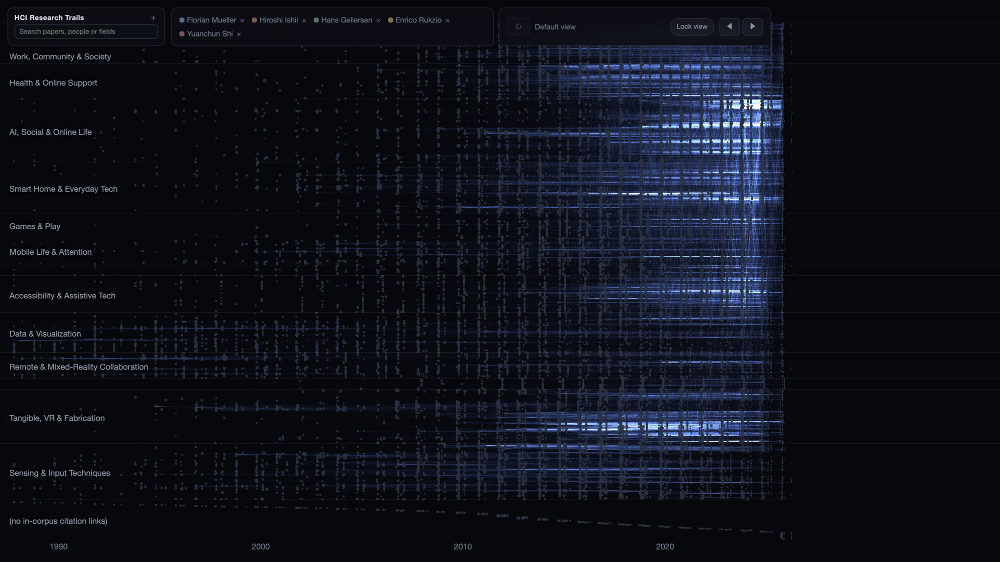
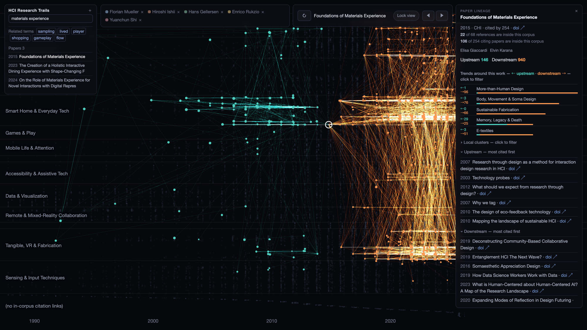
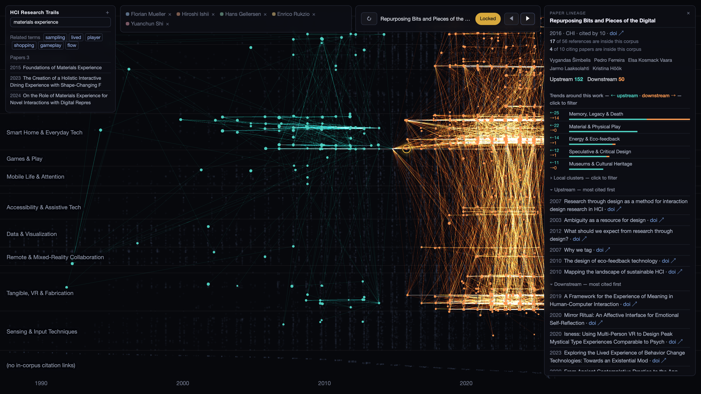
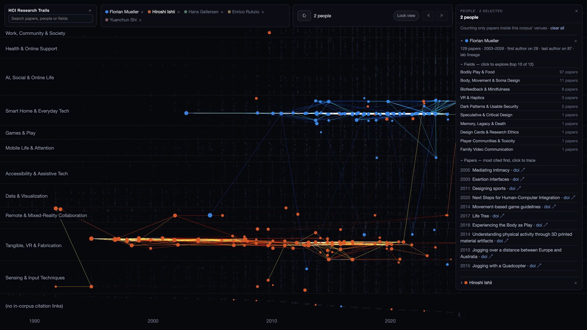
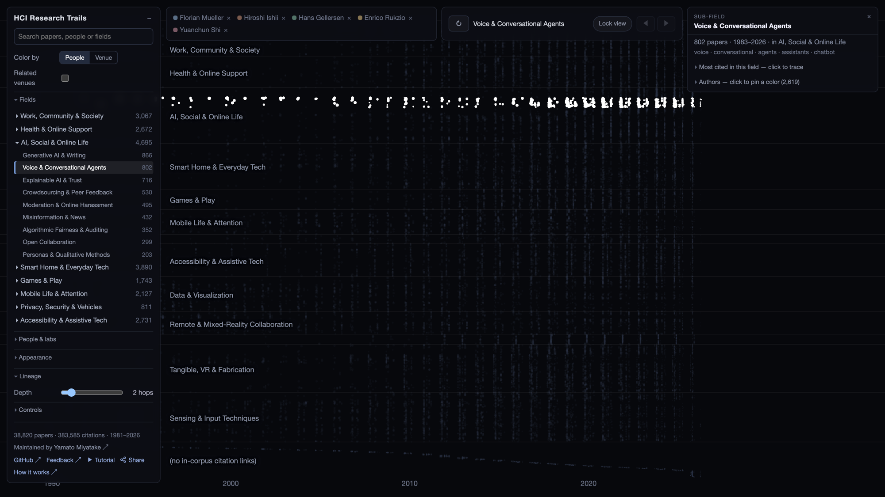

# HCI Research Trails

**Live: https://hci-research-trails.vercel.app**

An interactive map of HCI research — **about 39,000 papers and 380,000 citations
from 13 major venues (1981–2026)**, laid out along time on a single WebGL canvas.
A toggle adds seven neighbouring venues, taking it to about 47,000 papers.
Research areas appear as named horizontal bands; citations flow left to right.



## 1. Trace a paper's lineage



- Click any paper: everything it builds on (upstream) and everything that later built
  on it (downstream) lights up.
- The side panel breaks the lineage down by research trend, with upstream:downstream
  ratio bars — click a trend to filter the view to it.
- **Local clusters** split the lineage by its own citation structure — UltraHaptics'
  descendants, for instance, resolve into branches like VR haptics, mid-air
  ultrasound, EMS and levitation.
- Right-click a paper for DOI and copy actions.
- Upstream and downstream each scroll inside the panel, so it always fits the screen.
- How all of this is computed: [docs/lineage.md](docs/lineage.md).

### Lock the view and read across it



**Lock view** (or the L key) freezes the highlight. The button sits in the bar along the
top, next to what you are looking at now and the ◀ ▶ steppers, in the same place
whether the view is locked or not. You can click
through other papers — or walk the whole frozen lineage in date order with ◀ ▶ and the
arrow keys — and read each one's panel while the map keeps showing the lineage you are
comparing against. A ring marks the paper you are on, and releasing returns you to the view you
locked. Clicking outside the frozen set does nothing — the badge flashes to say why —
and double-clicking a paper inside it moves the lock there, so the comparison can
follow wherever the reading takes you.

## 2. Follow people



- Search names to add them to the legend (up to 15 people).
- Click them and their papers light up across the map, with same-lab citations (same
  last author at both ends) drawing the lab's thread through the decades.
- Focus one or several people: only their papers stay bright, and the panel shows each
  person's sub-fields and most cited work side by side.
- A toggle switches between "any authorship" and "last-author only".
- Clicking one of their papers drops into its lineage. The bar along the top names what
  you are looking at now, and ‹ (or ⌘[) walks back through everywhere you have been —
  people, fields and every paper you opened — until you are back at the whole map.

## 3. Explore the field



- 14 bands and 112 sub-fields, all named; labels appear as you zoom (16 and 141 with
  related venues on).
- Browse them all from the **Fields tree** (or search them by name): selecting a field
  highlights its papers and lists both its most cited work and everyone publishing in it.
- **Shift+scroll zooms topics without stretching time**; Alt+scroll zooms time only.
- Search any topic ("haptic", "fabrication") to see where and when it lives on the map,
  with related-term suggestions.
- Colour by people & labs, or by venue.

## Share what you are looking at

**Share** offers the plain link by default. Tick "Link to this view" and it also
carries the selected paper, the people and the camera — a particular lineage can be
sent to a co-author or cited in a talk.

## Tutorial

Nineteen seconds of it moving — no narration, just the parts that light up:


The same beats as stills, one per section, are in
[docs/media/highlights/](docs/media/highlights): searching and tracing a paper, opening
the depth one hop at a time, filtering the lineage by field, locking the view to read
across it, stacking five people, walking the Fields tree, and recolouring by venue.

The **Tutorial** link in the panel plays the full 87-second walkthrough
([docs/media/tutorial.mp4](docs/media/tutorial.mp4)), which is also available as a
[full-speed GIF](docs/media/tour.gif). Both still show the previous layout.

## Reading the map

- **x-axis = publication year.** Citations only ever flow left to right.
- **Bands = citation communities**, sized by paper count and named down the left edge.
- **Bright routes = main paths** (edges weighted by search path count).
- **Dot size = citations.** Colour belongs to the people you have selected.

## Data notes

Corpus: CHI, PACM HCI, UIST, DIS, ASSETS, IUI, CSCW, TEI, IMWUT, UbiComp, CHI PLAY,
MobileHCI, TOCHI. A **Related venues** toggle adds HRI, IEEE VR, ISMAR, SIGGRAPH,
TOG, IJHCS and IEEE ToH — partially: only papers with at least one citation link to
the core corpus are included, and the UI marks them as such. About 75% of references point outside these venues and are excluded —
the UI states this wherever it limits what you see (an empty upstream list means the
paper cites work outside the corpus, not missing data). Band names are LLM-generated
once and committed; everything else is computed deterministically from citation data.

## Running locally

```bash
# Serve the repo root, then open /viewer/index.html
python3 -m http.server 8137
```

The committed `data/viz/` is all the viewer needs. To rebuild from the public APIs
(Semantic Scholar for the corpus, OpenAlex for citations):

```bash
cd pipeline
uv run python -m paperlineage.fetch_corpus    # ~10 min, resumable
uv run python -m paperlineage.fetch_refs      # ~40 min, resumable
uv run python -m paperlineage.build_graph
uv run python -m paperlineage.spc
uv run python -m paperlineage.layout --mode community
```

Every stage is deterministic (fixed seeds) and reports everything it drops.

**Want this map for your own field?** The venue list is the only HCI-specific
part — see [docs/build-your-own.md](docs/build-your-own.md).

## Documentation

[How lineage is computed](docs/lineage.md) explains the algorithms;
[build a map for your own field](docs/build-your-own.md) covers adapting the
pipeline to another research area.
The repository / development name is `paper-lineage`.

## License

MIT
